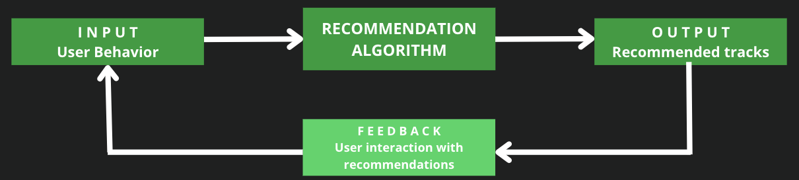
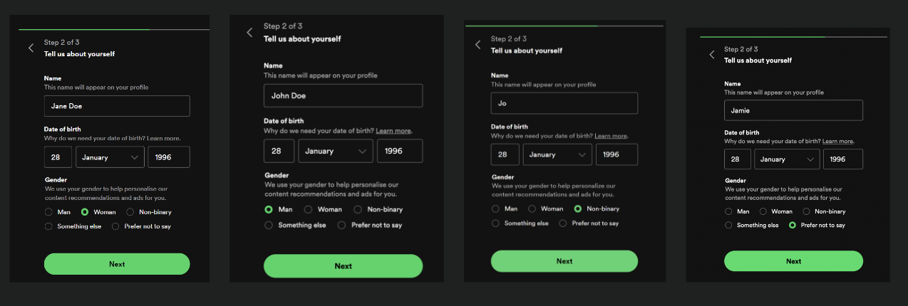

# The Bias Broadcast: Gender Discrepancies in Spotify's Algorithmic Podcast Recommendations
#### Janine Ecker, Łukasz Kaźmierczak, Anna Padiasek, Sophie Shanshory

## Table of Contents
[1. Introduction](#introduction)

[2. Literature Review](#litreview)

[3. Data Collection and Methodology](#method) 

[4. Results and Analysis](#results)

[5. Challenges and Limitations](#limits)

[6. Conclusion and Recommendations](#concl)

[Bibliography](#bibl)

## 1. Introduction

 
With the rapid democratization of Artificial Intelligence (AI) and its continued integration into various areas of daily life, its implications for society, the economy, and culture are widely discussed. Yet, amidst the discussions of AI's transformative capabilities, it silently integrates into the most routine parts of our daily lives. Think about the times we listen to music during our commute or enjoy podcasts while doing household chores – these everyday activities are guided by AI recommendation systems.

 
Streaming services have emerged as the main way people enjoy audio content, with streaming representing 67% of the music sector’s global revenue (IFPI, 2023). Among these platforms, Spotify stands as the undisputed leader, offering an extensive library of over 100 million tracks and 6 million podcasts to a user base of 615 million across 180 markets (Spotify, 2024). Streaming makes accessing music and audio content available anywhere, anytime and on all kinds of devices, either for free or for a comparatively low monthly subscription fee promising unmatched convenience and accessibility, undoubtedly revolutionizing how we access music and podcasts. 

 
Behind the scenes of this seamless music consumption experience lies the sophisticated AI recommendation system employed by Spotify. Crucially, Spotify taps into a wealth of data from its immense user base, collecting user interactions, listening habits, preferences, and demographic information, which can be fed to its recommendation algorithms. This enables Spotify to provide users with personalized recommendations such as curated playlists, suggested tracks, and personalized "For You" selections, enhancing the overall listening experience.

 
However, the influence of Spotify's AI recommendation system extends beyond mere convenience. This algorithmic guidance doesn't just influence users' musical choices. By steering users towards specific genres, artists, and trends, these algorithms play a pivotal role in shaping not only individual listening preferences but also in molding broader cultural conversations and trends, potentially reinforcing biases. This algorithmic curation can influence users' perceptions of music, affect their consumption patterns, and contribute to the formation of societal norms and preferences. Thus, Spotify's recommendation system holds considerable influence in shaping cultural landscapes and societal dynamics beyond the realm of audio consumption.

 
It is all the more concerning that the inner workings of these recommendation systems are a “black box” and remain opaque. Users are left in the dark regarding which data is fed to the algorithm and how recommendations are generated, prompting questions about transparency and the potential for biases to influence the outcomes. Of particular concern is the potential for gender bias within Spotify's recommendation algorithms. Creating a Spotify account requires the user to choose between “man”, “woman”, “non-binary” or “prefer not to say”. The implications of gender bias within recommendation systems are far-reaching, potentially reinforcing stereotypes, marginalizing certain demographics, and perpetuating societal inequalities. Without transparency and accountability, there is a risk that Spotify's recommendation system may inadvertently contribute to these biases, shaping users' listening experiences in ways that reflect and perpetuate gender-based stereotypes and preferences. 

 
Our research seeks to address the following research question: How does the gender specification on user profiles impact the recommendations provided by Spotify's Algorithmic recommendation system? Our analysis aims to uncover potential biases that may exist within the recommendation algorithms, particularly regarding the content suggested to users. 

 
For this purpose, we conducted an experiment setting up four Spotify accounts, each with different gender specifications, and analyzed the personal recommendations over time after listening to the same podcast holding all other parameters constant. By systematically comparing the recommendations provided to each account, we sought to reverse-engineer the influence of gender specification on Spotify's recommendation system. Through this methodical approach, we aimed to discern any patterns or biases in the recommendations and shed light on how gender specification may impact users' experiences within the platform. 

#### How do Spotify’s algorithmic recommendations work? 

 
Spotify uses an algorithm system called “Bandits for Recommendations as Treatments” (Eticas Foundation, 2022). This recommendation algorithm is proprietary and treated as Intellectual Property (IP) by the company. Consequently, it remains a black box for both users and researchers, neither having insights into the parameters fed to the algorithm nor how they are processed to generate personalized recommendations. On its website, Spotify established a “Safety & Privacy Center” where they aim to “demystify” how their recommendations work (Spotify, 2024). They outline four inputs which the algorithm relies on to select and order content across each listener's Spotify experience, including in Search, Home, and in personalized playlists, notably (i) trends, (ii) content information, (iii) personal data, and (iv) taste profile. 

 
Following this outlined input structure, Spotify's algorithm firstly examines broader trends and user behaviors to enhance recommendations. By analyzing collective user behavior, the algorithm can refine recommendations for everyone. For instance, if many users engage with a particular song or podcast, Spotify is likely to recommend it to others with similar interests. A second input category is content information including characteristics like genre, release date, and podcast category. This allows Spotify to identify content with similar attributes that may appeal to comparable listeners. Spotify’s metadata is quite extensive, adding indexes such as “popularity“, “danceability” or “energy” to each track. Thirdly, Spotify cites “information you share with us” meaning personal data, as an input source. This includes for instance the location, language, age and followers. Interestingly, on this exemplary selection on their  website Spotify does not explicitly name gender as an input variable. Lastly and cited as the most important input is the taste profile which is built from user interactions such as searching, listening, skipping, or saving to Your Library. This profile offers insights into preferences and guides Spotify's algorithms in tailoring recommendations. Exercising our data subject rights under the EU's General Data Protection Regulation (GDPR) revealed that each stream collects a comprehensive set of 22 data points. These include details like device used, offline or online listening, incognito mode usage, access method, reasons for stoppage, and skipping behavior.

 
In general, content recommendation systems can be split into two different classes: collaborative filtering which recommends items based on the preferences and behaviors of similar users or items, and content-based filtering, which recommends items based on their attributes and the user's preferences. Based on Spotify’s own specifications we can thus derive that it uses both these algorithms as well as Natural Language Processing (NLP) to analyze news, articles and blogs written on the web about specific songs or artists (Mohan, 2023). 

 
Overall, although Spotify has publicly disclosed some information about its algorithm, these details remain vague and do not allow for a thorough analysis of the algorithm. Several empirical studies have attempted to uncover the inner workings of this black box (Anderson et al., 2020; Hodgson 2021; Björklund et al., 2022). However, to date, the algorithm remains opaque, limiting the ability to conduct a comprehensive assessment and analysis of potential biases. 

 

  
  *Figure 1: Spotify recommendation system.*
    

## 2. Literature Review

#### 2.1. (Gender) Bias in Recommendations

Gender bias in recommendations is a multifaceted issue and can originate from different sources, primarily (i) the datasets used to train algorithms, where disproportionate data on certain user groups or artists can skew results, and (ii) algorithmic bias, where recommendation systems may perpetuate or exacerbate existing biases in data (Knibbe, 2021). 

Firstly, there might be a population bias which occurs when a dataset reflects societal imbalances. If Spotify's dataset overwhelmingly features music by male artists, the algorithm will naturally recommend them more often, even to users who might enjoy female artists equally (Aguiar et al., 2018). 

Secondly, streaming platforms like Spotify face growing concerns about algorithmic bias and discrimination, particularly regarding gender misrepresentation. As Hodgson (2021) argues, algorithms can reinforce existing stereotypes by promoting specific genders within genres. Indeed,  one of the first empirical studies in the field conducted by Eriksson and Johansson (2017) seems to confirm this claim, as they discovered that Spotify recommendations tend to favor male artists across all genres.  Aggravating this issue is the feedback loop amplification where if the algorithm relies heavily on user feedback to refine recommendations, it may inadvertently amplify existing gender biases by reinforcing patterns of content consumption and preference based on historical user interactions.  

Aguiar et al. (2021) further complicate the issue by pointing out that human curation of some playlists contributes to the problem where human-curated playlists and recommendations may reflect implicit biases held by playlist curators or content reviewers. Therefore, the misrepresentation cannot purely be attributed to AI systems. 

#### 2.2. Podcast Recommendations

 

We focused on analyzing podcast recommendations as it presents a promising research angle for analyzing algorithmic biases compared to music. Unlike music, where identifying gender stereotypes in content can be challenging due to diverse genres and themes, podcasts often have clearer gender affiliations in topics and host composition. This clarity in gender association within podcasts may facilitate a more nuanced examination of algorithmic biases related to gender. This becomes even more relevant given the increased demand for podcasts in recent years and the growing share of Spotify’s revenue coming from this stream (Majidi, 2023; Casanova). 

Furthermore, the issue of how algorithms shape users’ podcast preferences remains relatively unexplored. There exists potentially even a secondary, compounding “black box” for podcast recommendation algorithms as we do not know to what extent recommendation systems for music and podcasts are distinct. This is because the way people listen to and share podcasts differs from these patterns concerning music in two primary ways: Firstly, regarding virality. Unlike music, podcasts struggle to achieve viral fame due to their lengthy format. Sharing recommendations becomes less effective when listeners can't as easily consume the entire episode as they would a song or even album. Secondly, podcasts and songs have different listening patterns. Once a user finishes listening to a certain episode, they rarely return to relisten it again (Rosenborg, 2024). Furthermore, recommendations can differ by platform. For example, Apple Music recommends shows to listeners, while Spotify recommends episodes (Misener, 2022). (Note that users on Spotify can view generalized music and podcast recommendations at the top of their homepage, but the emerging categories/groupings of recommendations based on user listening patterns include categories such as “Episodes for you” and “Popular with listeners of [podcast name],” which recommend specific episodes rather than a full show.)

As mentioned, podcasts and podcast recommendation systems are far less studied than those for music recommendations. In 2020, Nazari et al. explored cross-domain podcast recommendations for “cold-start users'' through their music listening history. They claim to be one of the first studies to focus on podcast recommendations. Notably, this study was a collaboration between Spotify and researchers at Cornell University. Nazari et al. studied interference techniques while considering possible emerging biases that music data as an input source could introduce. They define a cold-start problem as “the challenge of making recommendations for users with little to no prior history with the service or medium.” Nazari et al. then tested a cross-domain methodology, using historical interaction data with other media (i.e., music) to produce podcast recommendations. The researchers found that their best-performing model suggested less homogenous recommendations across different podcast categories compared to the popularity baseline system (Nazari et al., 2020). Other literature on podcast recommendations has focused on targeting users’ aspirational consumption through recommendations and predicting user preferences through classification systems (Yang et al., 2017; Tsagkias et al., 2009).

It is also worth mentioning other research and analysis of podcast recommendations outside of the academic space. A study conducted by Bumper, a company describing itself as a “podcast growth agency,” mapped Spotify podcast recommendations by gathering episodes of “charting” shows as well as the following six recommended episodes (capturing the six recommendations was repeated twice). Approximately 14% of recommended episodes were Spotify originals or exclusives. Interestingly, Bumper found that Spotify did not promote controversial podcast host Joe Rogan’s show The Joe Rogan Experience despite it being a high performing podcast that is regularly featured on the “Top Podcasts” charts (for reference, on 15/5/24, Joe Rogan’s podcast was at Number 1 on the list in the United States.) This discovery coincides with some of the discourse about which podcasts go viral online: “Many interview-based podcasts from the so-called manosphere have perfected the clickbait formula by figuring out that controversy generates engagement and increases their recommendation positioning on social media platforms and YouTube.” While the non-viral nature of podcasts “on-platform” relates to recommender systems lacking robustness, outside of platforms like Spotify, “off-platform” virality can still occur – for example, if a video of an episode trends on other social media platforms like TikTok or YouTube.

However, success off-platform does not necessarily translate to creating more podcast streamers on-platform, especially when users can access snippets from an episode elsewhere. (Rosenborg, 2024) Such an approach to off-platform promotion may have implications on understanding podcast recommendations if we are able to one day more deeply investigate how podcast recommendation algorithms weight popularity compared to user preferences.

Finally, does the apparent success of highly-gender podcasts from the manosphere have implications on gendered recommendations more broadly? Because there is little research about podcast recommendations, and none that we could find about gendered recommendations, there is significant space to investigate how recommendations may fall along gendered lines due to a host of factors such as the gender of the listener as well as cross-domain listening history, podcast marketing and brand imagery, popularity, etc. We will seek to build upon these ideas in the coming sections.

## 3. Data Collection and Methodology

Investigating potential biases in Spotify’s is challenging, given that independent researchers do not have access to the system’s black box and thus requires reverse-engineering to gain insights into the opaque system. We devised an innovative research design to address our research question regarding how gender specification on user profiles affects Spotify's algorithmic recommendations. The core idea of the experiment  was to hold all parameters constant to only have variation in the gender specification. 

  
#### Account creation 
We started by creating four new Spotify accounts with distinct gender identities: John Doe (man), Jamie Doe (prefer not to say), Jo Doe (non-binary), and Jane Doe (woman). All accounts utilized gender-neutral email addresses (e.g. zctqlgk@proton.me) to ensure gender wasn't revealed through the email address.

 

  
  *Image 2: Creation of the accounts.*
    

#### Listening experiment

 
The idea of the experiment was to hold all parameters constant to only have variation in the gender specification. By holding factors such as date and time (started simultaneously), location (Paris region), and means of access constant (laptop, browser), we aimed to eliminate external variables that could potentially skew the results. This approach ensured that any observed differences in recommendations could be directly attributed to variations in gender specification, rather than other extraneous factors. 

##### Stage 1 - Music: 

 
Firstly, we listened to music from the ‘New Music Friday’ playlist for two weeks at the same intervals. This playlist is one of the most important avenues for emerging artists to promote their music (Aguiar and Waldfogel, 2020). Every week, 50 new songs are added to each country’s playlist. In the first week, we listened to half of the ranking, and in the next week, we completed the entire playlist. We then shifted our primary data collection and analytical focus to podcasts. Afterwards, we coordinated listening to a playlist with a generic name, ‘My Playlist #1’, featuring 26 songs that overlapped across all four accounts.

##### Stage 2 - Podcasts: 

 
We coordinated listening to 8 episodes, totalling approximately 9 hours, of ‘The Girls Bathroom’, a female-hosted show from the UK that explicitly targets women. We purposefully chose a podcast targeting female recipients to identify subsequent patterns in the recommendations (the complete list of the episodes played can be found in the Annex). 

#### Data collection and comparative analysis

 
Throughout the experiment, we captured screenshots of the recommended podcasts for each user to compare and identify potential discrepancies. We took the screenshots each day after streaming the podcasts. Once we concluded the experiment, based on the screenshots, we manually coded all the personalized recommendation information in a spreadsheet which served as the corpus of our analysis. This dataset includes information on the date of recommendation, source of personalized recommendations (initial podcasts; episodes for you; recommended podcasts), account from which the data comes, the name of the podcast, podcast label(s) (up to 3, decided by creators/Spotify), host (1 - all female, 0 - otherwise). Finally, we included a variable on whether a podcast is ‘overtly female-oriented’ (similarly to ‘The Girls Bathroom’), which we decided based on the following criteria: 

  ##### -  Content and Themes: 
Focus on traditionally feminine topics: This includes topics like relationships, beauty and fashion, body image, childcare and family life, and celebrity gossip.
##### - Health and wellness: 
Podcasts that focus on health, wellness, and beauty standards are often considered female-oriented.
##### - Language and Tone: 
Focus on personal stories and experiences: Podcasts that prioritize emotional responses and personal stories may cater to a female audience, particularly when compounded by other criteria. (For example, we found a number of self-help podcasts seemingly oriented to a male-dominated audience that may have touched on personal stories as well, but for female-oriented podcasts, we were able to identify the above-mentioned content/themes in conjunction with personal stories.)
##### - Marketing and Branding: #####
We looked for imagery, descriptions, or slogans that may be stereotypical and target a female audience.
##### - Genre Classification by Spotify: #####
Although Spotify's categorization (e.g., "Relationships" or "Personal stories") is not conclusive, we took it into account when uncertain, alongside other criteria. These genres may suggest a female-oriented focus.

Based on the dataset, we analyzed the patterns and created visualizations to understand the developments better. 

## 4. Results and Analysis

#### 4.1. Results on the gender bias in Spotify music recommendations.

 
On examining the Discover Weekly Playlists recommended for the four accounts after two weeks of listening to the New Music Friday playlist, the vast majority of songs (26 of 30 songs) in the playsts overlapped. It is thus impossible to state whether the differences observed had any significance and were influenced by the gender assigned to each of the accounts. Due to the design of the experiment, such that only one account per each gender category was created, no intra-gender comparison could be made, to state if such differences are not random. Therefore, we have decided to discontinue the analysis of music recommendations. No differences in Spotify music recommendations were furthermore noted, on listening to the specifically curated playlist (“My Playlist #1”). Future research could build upon this design barrier, using multiple accounts of the same gender to confirm our initial hypothesis.

#### 4.2. Results on the gender bias in Spotify podcasts recommendations.

 
“Feeding” the Spotify podcasts recommendations’ algorithm took time for all four accounts, with at least three listening sessions needed to receive recommendations related to the content of the podcasts we had listened to. This lag can likely be explained by the previously mentioned “cold-start problem” because the recommendation system lacked a robust music listening history (and had no podcast listening history whatsoever) to begin building its recommendations on. Spotify did not have significant data off of which to base personalized recommendations. (Potential responses to this problem by recommender systems include onboarding (presenting options to a user and asking them to rank their preferences; scraping online information about a user; and updating suggested content based on user ratings) (Nazari et al.).  The category monitored (“Recommended Podcasts”) always contained nine podcasts recommendations for all accounts tested, with the recommendations changing daily. Each time, apart from the data gathered on 23rd April 2024 which reflect the initial podcast recommendations, the recommendations data were gathered after a listening session, to account for a possible stagnation of recommendations of the account due to lack of consistent listening activity. That is because the accounts were only used for podcast listening sessions of up to 3 hours long.

##### 4.2.1. Changes in numbers of stereotypically female podcasts recommended for the accounts over time.

Our findings suggest that there exists a disparity in the speed of Spotify podcasts recommendation of stereotypically female podcasts, depending on the gender of the user. As such, gender stereotypes may thus influence whether a user receives personalised recommendations if the interests of the user go against the stereotypical subjects associated with a given gender. In comparison to accounts associated with “woman”, “non-binary” and “prefer not to say” categories, the “man” account took longer to adjust its recommendations to podcasts classified as stereotypically female (see Figure 1). While “woman”, “non-binary” and the “prefer not to say” accounts received between 33-44% of the recommendations as female-coded podcasts after just three listening sessions, the “John Doe” account did so only after four listening activities (2nd May 2024). The account classified as “woman” was the first one to reach almost universally female-coded recommendations, with eight female-coded podcasts recommended out of nine possible recommendations. However, on additional listening sessions, the number of female-coded recommendations for this account dropped, reaching only 6 out of 9 on the last day of the study. 

 

  
  
  *Figure 1: Changes in the number of stereotypically female podcasts recommended to the four user accounts over time.*
    

 

  
  
  *Figure 2: Changes in the number of stereotypically female podcasts recommended to the four user accounts over time, shown as a trend for each account.*
    

Conversely, even though the account classified as “man” did not begin to receive recommendations as early as the other accounts, after six listening sessions it was the one to receive the most female-coded recommendations - 8 out of 9 possible recommendations were female-coded for this user, on 9th May 2024 as well as on the last day of the study (12th May 2024). The “non-binary” and “prefer not to say” accounts also experienced upward trends in terms of the number of stereotypically-female podcasts recommended to them over time. The “non-binary” account was the least affected account out of four categories tested, receiving a maximum of 66% recommendations coded as stereotypically female. Similarly, the “prefer not to say” account, although steadily rising in the number of female-coded recommendations, received no more than 7 out of 9 recommendations coded as stereotypically female.

##### 4.2.2. Recommendations of specific podcast categories for the accounts.

For each podcast recommended, its category labels were gathered. The labels are chosen by the podcast author to describe the main subject with which a given podcast is concerned, and up to 3 labels are available per podcast. Overall, the main category of podcasts recommended among the four accounts was Comedy (72 recommendations), followed by Culture (37) and True Crime podcasts (25). A significant part of the recommendations was focused on personal topics, including Personal Stories (24 recommendations), Self-Help (24) and Health-related subjects (22).

 

  
  
  *Figure 3: Main categories of podcasts recommended for all the accounts.*
    

For each of the four accounts, the main category of podcasts recommended was “Comedy”. “Culture” was the second biggest category of podcasts for accounts associated with “woman”, “man” and the “non-binary” accounts and the third biggest for the “prefer not to say” account. Surprisingly, “True Crime” podcasts were more often recommended for the “female”, “non-binary” and the “prefer not to say” account than for the male account which instead received recommendations for podcasts related to “Society” issues. “Personal Stories” and “Self-Help” categories were found to be common for all accounts, with the highest numbers recommended for the “prefer not to say” account (10 recommendations per each of the categories). 

 

  
  
  *Figure 4: Main categories of podcasts recommended for the "woman" account.*
    

    

 

  
  
  *Figure 5: Main categories of podcasts recommended for the "man" account.*
    

 

  
  
  *Figure 6: Main categories of podcasts recommended for the "prefer not to say" account.*
    

 

  
  
  *Figure 7: Main categories of podcasts recommended for the "non-binary" account.*
    

The high number of “True Crime” podcasts, noticeable for the female account, needs to be analyzed within the context of trends in podcasts popularity among women. While men are more likely in general to listen to podcasts (Riordian, 2018), women consume significantly more true crime media (Vitis and Ryan, 2023; Browder, 2006). Reasons for such behavior according to the literature include the desire to seek justice for victims outside of the legal institutions (Paquet, 2021), the need to gather knowledge on safety precautions in the event of a possible attack (Murley, 2008) or the need of finding a support group of listeners to talk through real-life issues with regard to violence, trauma or assault using podcasts as a starting points for such discussions (Greer, 2017). Therefore, although not accounted as stereotypically female in the study, TCPs can also be seen as a gendered recommendation.

##### 4.2.3. Spotify podcast recommendations of female-hosted podcasts over time.

Additionally, we have observed an upward trend in the recommendations of female-hosted podcasts. As the accounts only listened to podcasts created by women, this was expected, however differences were observed in the growth of the number of recommendations skewed towards female hosts. The male account only received a significant number (4 out of 9) of female-hosted recommended podcasts after four listening sessions (2nd May 2024), while for the female and the “prefer not to say account” the Spotify podcasts recommendations included almost solely female-led shows since the fourth listening session (7 out of 9 recommendations on 2nd May 2024). Nevertheless, at the end of the experiment, the majority of the podcasts recommended for all accounts was female-hosted.

 

  
  
  *Figure 8: Changes in the number of female-hosted podcasts recommended to the four accounts over time.*
    

 

  
  
  *Figure 9: Changes in the number of female-hosted podcasts recommended to the four accounts over time, shown as a trend for each account.*
    

On looking separately at the accounts, over time the “prefer not to say” account received the greatest number of female-hosted podcasts out of all accounts (60% of recommendations) while 56% of podcasts recommended for the female account were created by women. The share of female-hosted podcasts recommended for the male and “non-binary” accounts was lower, and amounted to 46% and 51%, respectively. This finding suggests that here, too, the gender of the user may have had an impact on the early podcasts recommendations of the users, with users not identified as “male” being more likely to receive recommendations of female-hosted podcasts.

## 5. Challenges and Limitations

 
While our analysis offers initial insights into Spotify’s recommendation algorithm, it's important to acknowledge several limitations that future research should address. These challenges relate to both conceptual and empirical aspects.

#### 5.1. Conceptual Challenges

 
Conceptually, defining gender biases in algorithmic recommendations faces several conceptual challenges. Firstly, subjective interpretations of what constitutes a biased recommendation complicate the establishment of clear criteria. This is particularly pronounced within the realm of podcasts, which remains relatively unexplored. As such, defining a 'bias' in podcast recommendations becomes even more elusive. Secondly, distinguishing between group fairness and individual fairness requires careful consideration of various factors, including content popularity and user behavior. In this project, we purposefully focused on “group fairness”, i.e. that any demographic group (gender in this case) should not be systematically disadvantaged (e.g. receiving less attention) by AI-generated recommendations. However, should we consider an algorithm inherently unfair when it predominantly recommends podcasts hosted by men to male listeners? Conversely, should we raise concerns when podcasts stereotypically aimed at women receive less visibility among this audience? These are pertinent questions that require substantial attention. As they remain unanswered, they intrinsically pose limitations in this unexplored field. Lastly, deciphering whether observed differences in recommendations point to gender biases or other factors like content popularity or user behavior patterns requires careful interpretation. Untangling gender-related biases from other confounding variables thus presents significant conceptual challenges.

#### 5.2. Empirical Limitations

 
Empirical challenges in our study revolve around both internal and external validity, limiting the robustness and generalizability of our findings.

 
Internally, isolating the gender specification by holding all other parameters constant proved difficult as certain parameters such as exact location, IP address or device brand differed. Additionally, an omission bias is very likely as we do not know which other variables are taken into account which might have varied from our different streaming set-ups. Further limiting our study’s validity is the small sample size both in terms of accounts and total time listened. Being only able to create and listen with one account/person prevented further controls. It would be very promising to extend the experiment over a longer time and listen to a bigger variety of content. It would have been interesting to listen to several popular podcasts on gendered lines, or to listen to the top recommendations for each profile to see where the various nodes led us (Misener, 2022).  

 
Externally, several aspects limit the generalizability of our findings notably the localized nature of our data collection as our experiment only took into account French inputs for instance French collective trends and listening behavior of French users. Furthermore, Spotify's algorithmic dynamics and likely continuous updating of the algorithm pose challenges for replication, adding to the difficulty of ensuring external validity. Lastly, the subjective nature of the manual coding of gender-typical recommendations needs to be acknowledged. Overall, these limitations underscore the need for caution in interpreting and generalizing our findings.

 
Future research can help address these conceptual and empirical challenges which will be essential for advancing our understanding of gender biases in algorithmic recommendations. This is vital given the risks and uncertainties inherent in algorithmic recommendation systems like those used by Spotify. By exploring these systems further, researchers can uncover potentially hidden biases, improve algorithmic transparency, and develop strategies to mitigate potential harms. Ultimately, advancing our knowledge in this area is essential for fostering a more equitable and inclusive digital landscape that benefits all users. 

## 6. Conclusion and Recommendations

In this investigation, we set out to uncover how the gender of different users may impact Spotify’s algorithmic systems delivery of recommendations. The black box of podcast recommendations proved particularly interesting because it remains underexplored. After creating four unique accounts, each with a different gender, and streaming hours of podcast content, we began to receive initial recommendations. At first, Spotify’s recommendations appeared to face a cold-start problem, lacking sufficient historical music and podcast inputs from which to craft its personalized suggestions. Over the next few listening sessions, however, the “woman”, “non-binary”, and “prefer not to say” accounts received female-coded recommendations earlier than the “man” account, though eventually the latter surpassed the former three and gained the most female-coded recommendations. Further, this lag in initial, female-coded recommendations was mirrored by the lagged recommendations of podcasts hosted by women – most notably for the “man” account –  though eventually all users’ recommendations exhibited an upward trend and the “man” account in fact surpassed the others again. Overall, the changes in recommendations of overtly-female podcasts as well as podcasts created by women were slower for the account categorized as “male”, despite the identical user activity of the accounts. Once the listening activity was established, the male account also received recommendations of topics stereotypically not related to that gender.

Our analysis suggests that the gender of the user may have an impact on the pace of providing podcasts recommendations on the Spotify platform. This impact can be analyzed using various categories, including the topic-specific recommendations or recommendations based on the gender of the podcast creator.

Given these observations, our first suggestion is unsurprisingly for more research to be conducted on podcasts and podcast recommendations systems. It is evident that the (limited) existing research on podcasts and their recommendation systems has overwhelmingly been conducted by stakeholders in the industry – streaming platforms like Spotify themselves or other companies that market themselves as podcast resource/support agencies. This has potentially interesting implications – especially because we still know very little about the unique black box for podcasts. Thus far, the research does not appear to seek to demystify the black box at all, because it is being carried out by the very stakeholders who shield its intricacies. If there were biases uncovered, the players paying for the research would have an incentive to limit some of those details or at the very least maintain the opacity of their algorithmic systems. (This is not to say there is no role for these stakeholders in the research, but they should not be the sole producers of it.) There is a need for more independent research, which could bring us closer to understanding the layers to these recommendation systems and to parse out any key differences between music versus podcast recommendations.

Though we were not able to definitively conclude that there are biases in the Spotify podcast recommendation system, the gender of a user could imply how quickly Spotify “corrects” its initial recommendations when it has little else off which to base them. Further, it does appear that Spotify at times “overcorrected” its lagged recommendations with the “man” account, offering more female-coded and female-hosted podcasts later on compared to the other accounts. While the platform may have corrected overtly female-focused content, podcasts focusing on True Crime (which is popular among women listeners and could potentially be coded as gendered content) did not receive the same overcorrection for the “man” account (this account only received a total of three recommended True Crime podcasts). This brings us to our second research-based suggestion: more research on gender and podcasts. On one hand, we encourage future research to examine gender and podcasting along our broad identified criteria – major themes, tone, and marketing. With respect to the latter criterion, our preliminary reflections found the three non-“man” accounts received higher suggestions for True Crime. While some of the positioning of these shows appeared quite neutral, the marketing of other True Crime podcasts appeared visually feminine, with pink branding that mirrored that of the chatty gossip and relationships-focused podcasts which we coded as overtly-female. Secondly, we see a need for research that focuses on the manosphere and its rising appeal and success in the podcasting space. We cannot understand gender on social media without interrogating this emerging cultural and political phenomenon. There is little academic literature focused on the manosphere across all social media platforms, not just within podcasting/streaming. This type of content focuses on men’s feelings of disenfranchisement, often dipping into misogynistic tropes and critiques of socio-political ideologies they see as sidelining men (Rich & Bujalka, 2023). Further, understanding this particular highly popular and highly gendered content on the Internet could shed light on other gender trends, especially when it comes to how other highly gendered but non-manosphere-focused content is recommended and disseminated to listeners.

Our findings also illuminate some broad trends about how different categories of podcasts are organized. This is potentially pertinent to gender issues because certain tags could be more or less associated with gender and user characteristics. Building off our initial suggestions, our third suggestion is to improve the categorization of podcasts on streaming platforms. There was highly inconsistent tagging across our podcast recommendations, with some tags being difficult to interpret alongside the podcast show and description (some podcasts had only one tag, some had none at all). If Spotify and other streaming services encourage more consistent tagging/categorization, this could prove to be a helpful tool in understanding how recommendations are made – and possibly to help improve their own preference-based recommendations.

## Bibliography

Aguiar, L., & Waldfogel, J. (2018). Platforms, Promotion, and Product Discovery: Evidence from Spotify Playlists (NBER Working Paper No. 24713).

Aguiar, L., Waldfogel, J., & Waldfogel, S. (2018). Playlisting Favorites: Is Spotify Gender Biased? JRC Digital Economy Working Paper 2018-07; JRC Technical Reports, JRC113503.

Aguiar, L., Waldfogel, J., & Waldfogel, S. (2021). Playlisting favorites: Measuring platform bias in the music industry. International Journal of Industrial Organization, 78, 102765.

Anderson, A., Maystre, L., Anderson, I., Mehrotra, R., & Lalmas, M. (2020). Algorithmic effects on the diversity of consumption on Spotify. Proceedings of The Web Conference 2020. doi:10.1145/3366423.3380281.

Björklund, G., Bohlin, M., Olander, E., Jansson, J., Walter, C. E., & Au-Yong-Oliveira, M. (2022). An exploratory study on the Spotify Recommender System. Information Systems and Technologies, 366–378. doi:10.1007/978-3-031-04819-7_36.  

Browder, L. (2006). Dystopian romance: True crime and the female reader. The Journal of Popular Culture 39(6): 928–953.

Casanova, A. (N.d.). What the podcast boom means for digital revenue in a post-pandemic landscape. FT Strategies. https://www.ftstrategies.com/en-gb/insights/what-the-podcast-boom-means-for-digital-revenue-in-a-post-pandemic-landscape/. 

Eriksson, M. C., & Johansson, A. (2017). Tracking Gendered Streams. Culture Unbound, 9(2), 163–183. https://doi.org/10.3384/cu.2000.1525.1792163

Eticas Foundation. (2022). Bart, Spotify’s Personalized Recommendation Algorithm.

Greer, A. (2017). Murder, she spoke: the female voice’s ethics of evocation and spatialisation in the true crime podcast, Sound Studies 3:2, 152-164.

Hodgson, T. (2021). Spotify and the democratisation of music. Popular Music, 40(1), 1–17.
IFPI. (2023). Global Music Report 2023. Retrieved from https://www.ifpi.org/wp-content/uploads/2020/03/Global_Music_Report_2023_State_of_the_Industry.pdf

Knibbe, J. (2021). Fairness in Question: Do Music Recommendation Algorithms Value Diversity? Music Tomorrow.

Majidi, M. (2023, 13 December). Share of podcast in Spotify’s advertising revenue the United States from 2019 to 2024. Statista. https://www.statista.com/statistics/1324009/spotify-podcast-ad-revenue-share-usa/. 

Melchiorre, A. B., Rekabsaz, N., Parada-Cabaleiro, E., Brandl, S., Lesota, O., & Schedl, M. (2021). Investigating Gender Fairness of Recommendation Algorithms in the Music Domain. Information Processing & Management, 58(5).

Misener, D. (2022, 22 August). I made a map of Spotify podcast recommendations. Here’s what I learned. Bumper. https://wearebumper.com/blog/2022/08/22/spotify-episode-recommendation-algorithm. 

Mohan, A. (2023). How does Spotify’s recommendation system work? Univ.AI.

Murley, J. (2008) The Rise of True Crime: Twentieth Century Murder and American Popular Culture, Bloomsbury 3PL.

Nazari, Z., Charbuillet, C., Pages, J., Laurent, M., Charrier, D., Vecchione, B., & Carterette, B. (2020). Recommending Podcasts for Cold-Start Users Based on Music Listening and Taste. Proceedings of the 43rd International ACM SIGIR Conference on Research and Development in Information Retrieval. https://doi.org/10.1145/3397271.3401101.  

Pâquet L (2018) Literary forensic rhetoric: Maps, emotional assent, and rhetorical space in Serial and Making a Murderer. Law and Humanities 12(1): 71–92.

Rich, B. & Bujalka, E. (2023, 21 February). The draw of the ‘manosphere’: understanding Andrew Tate’s appeal to lost men. The Conversation. https://theconversation.com/the-draw-of-the-manosphere-understanding-andrew-tates-appeal-to-lost-men-199179.

Riordan, K. (2018). Commentary: The mobile phone as the new transistor radio. In: Park S, Fisher C, Fuller G, et al. (eds) Digital News Report: Australia. Report. News and Media Research Centre, University of Canberra.

Rosenborg, R. (2024, 10 January). Podcasts have a recommendation problem. MIDiA Research. https://www.midiaresearch.com/blog/podcasts-have-a-recommendation-problem. 

Spotify. (2024). Understanding recommendations on Spotify.

Spotify (2024). About Spotify. Retrieved from https://newsroom.spotify.com/company-info/

Tsagkias, M., Larson, M., & De Rijke, M. (2010). Predicting podcast preference: An analysis framework and its application. Journal of the American Society for Information Science and Technology 61, 2 (2010), 374–391. 

Vitis, L., & Ryan, V. (2023). True Crime Podcasts in Australia: Examining Listening Patterns and Listener Perceptions, Journal of Radio & Audio Media, 30:1, 291-314.

Yang, L., Sobolev, M., Wang, Y., Chen, J., Dunne, D., Tsangouri, C., Dell, N., Naaman, M., & Estrin, D. (2019). How Intention Informed Recommendations Modulate Choices: A Field Study of Spoken Word Content. In The Web Conference. ACM.
